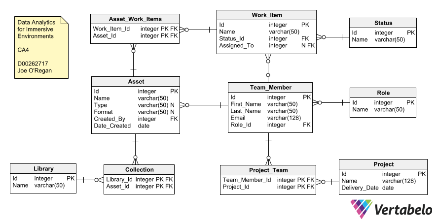

<!-- style for table rows -->
<style>
.table-striped tr:nth-child(even) {background: #D3EDF9;}
.query-striped tr:nth-child(even) {background: #FBBBBB;}
.table-hover tbody > tr:hover {background-color: #00EDF9;}
.query-hover tbody > tr:hover {background-color: #FC3C3C;}
</style>

<!-- clear console -->
```{r setup, include=FALSE}
cat('\014')
# knitr::opts_chunk$set(echo = TRUE)
```

---

# ER Diagram



---

\newpage
# Make Database Connection

```{r setup libraries, include=FALSE}
# libraries to query database
if(!require("DBI"))
  install.packages("DBI")
if(!require("dplyr"))
  install.packages("dplyr")
if(!require("knitr"))
  install.packages("knitr")
if(!require("kableExtra"))
  install.packages("kableExtra")
library(DBI) # Interface with database
library(dplyr)
library(knitr) # Display data in tables
library(kableExtra) # Format tables
```

Connect to the sqlite database file.

```{r connect to the sqlite database file}
# connect to the sqlite database file
conn <- dbConnect(RSQLite::SQLite(), "daie_ca4_data.sqlite")
```

---

# Show Table Data

Contents of tables to check queries against.

Function to format tables for HTML and PDF output. Display tables using knitr library's kable function and kableExtra to format tables.

```{r}
data_format.function <- function(data, type="table", bgcolour="#28B3F9") {
  data %>%
    { 
      if (is_html_output()) { # if the output is HTML add class attribute
        kbl(., table.attr= paste("class='",type,"-striped ",type,'-',"hover'", sep="")) %>% 
        kable_styling(bootstrap_options = c("striped", "hover"))
      }
      else if (is_latex_output()) { # if the output is PDF ignore class attribute
        kbl(.) %>%
        kable_styling(latex_options = c("striped","HOLD_position"))
      }
    } %>% # pdf output keep tables in position
      # kable_styling("striped", ifelse(is_html_output(),"hover","hold_position")) %>%
        row_spec(0, background = bgcolour) # table heading colour
}
```

---

## Status

Status table data.

```{sql connection=conn, output.var="status_data"}
SELECT * FROM Status -- get all data in Status table
```

Display Status table using above data format function.

```{r output status table contents}
data_format.function(status_data) # format data with function above
```

## Role

Role table data.

```{sql connection=conn, output.var="role_data"}
SELECT * FROM Role -- get all data in Role table
```

```{r output role table contents}
data_format.function(role_data) # format data with function above
```

## Team_Member

Team_Member table data.

```{sql connection=conn, output.var="team_member_data"}
SELECT * FROM Team_Member -- get all data in Team_Member table
```

```{r output team_member table contents}
data_format.function(team_member_data) # format data with function above
```

\newpage
## Work_Item

Work_Item table data.

```{sql connection=conn, output.var="work_item_data"}
SELECT * FROM Work_Item -- get all data in Work_Item table
```

```{r output work_item table contents}
data_format.function(work_item_data) # format data with function above
```

## Project

Project table data.

```{sql connection=conn, output.var="project_data"}
SELECT * FROM Project -- get all data in Project table
```

```{r output project table contents}
data_format.function(project_data) # format data with function above
```

\newpage
## Project_Team

Project_Team table data.

```{sql connection=conn, output.var="project_team_data"}
SELECT * FROM Project_Team -- get all data in Project_Team table
```

```{r output project_team table contents}
data_format.function(project_team_data) # format data with function above
```

## Asset

Asset table data.

```{sql connection=conn, output.var="asset_data"}
SELECT * FROM Asset -- get all data in Asset table
```

```{r output asset table contents}
data_format.function(asset_data) # format data with function above
```

\newpage
## Asset_Work_Items

Asset_Work_Items table data.

```{sql connection=conn, output.var="asset_work_items_data"}
SELECT * FROM Asset_Work_Items -- get all data in Asset_Work_Items table
```

```{r output asset_work_items table contents}
data_format.function(asset_work_items_data) # format data with function above
```

## Library

Library table data.

```{sql connection=conn, output.var="library_data"}
SELECT * FROM Library -- get all data in Library table
```

```{r output library table contents}
data_format.function(library_data) # format data with function above
```

\newpage
## Collection

Collection table data.

```{sql connection=conn, output.var="collection_data"}
SELECT * FROM Collection -- get all data in Collection table
```

```{r output collection table contents}
data_format.function(collection_data) # format data with function above
```

---

\newpage
# Database Querying

Query the above database using SQL queries demonstrating the following SQL concepts:

1. SELECT with WHERE, LIKE, and OR
2. SELECT with DISTINCT and ORDER BY
3. Inner Join
4. Subquery with SELECT
5. SELECT across a date range

\newpage
## 1. SELECT with WHERE, LIKE, and OR

### 1.1 Select with WHERE

Find Team Members who have the first name Joe.

```{sql connection=conn, output.var="query1_select_with_where"}
SELECT * FROM Team_Member WHERE First_Name = 'Joe';

```

Format the query output as a table with kable and kableExtra function above.

```{r select with where}
data_format.function(query1_select_with_where, "query", "#FF0000") # format data
```

### 1.2 SELECT with LIKE

Using wildcards to substitute one or more characters in a string.

#### **1.2.1 Select with LIKE and** \'_\' **wildcard**  
  \
Find Team Members with first name with 3 characters beginning with "jo" using '_' wildcard.

```{sql connection=conn, output.var="query2a_select_with_like"}
SELECT * FROM Team_Member WHERE First_Name LIKE "jo_";
```

```{r select with like single character wildcard}
data_format.function(query2a_select_with_like, "query", "#FF0000")
```


#### **1.2.2 Select with LIKE and** \'%\' **wildcard**  
  \
Find Team Members with last name containing the string "derp" using '%' wildcard.

```{sql connection=conn, output.var="query2b_select_with_like"}
SELECT * FROM Team_Member WHERE Last_Name LIKE "%derp%";
```

```{r select with like}
data_format.function(query2b_select_with_like, "query", "#FF0000")
```

\newpage
#### **1.2.3 Select with LIKE and** \'%\' **and** \'_\' **wildcard**  
  \
Find Team Members with first name beginning with "jo" with at least 3 characters, i.e. excludes "Jo".

```{sql connection=conn, output.var="query2c_select_with_like"}
SELECT * FROM Team_Member WHERE First_Name LIKE "jo_%";
```

```{r select with like both wildcards}
data_format.function(query2c_select_with_like, "query", "#FF0000")
```

### 1.3 SELECT with OR

#### **1.3.1 OR with numeric comparison**  
  \
Select Team Members where the Role_Id is 2 OR 7.
  
```{sql connection=conn, output.var="query3a_select_with_or"}
SELECT * FROM Team_Member WHERE Role_Id = 2 OR Role_Id = 7;
```

```{r select with or numeric}
data_format.function(query3a_select_with_or, "query", "#FF0000")
```

\newpage
#### **1.3.2 OR with string comparison**  
  \
Select Team Members whose first name is "Herpa" or last name is "Derpa".
  
```{sql connection=conn, output.var="query3b_select_with_or"}
SELECT * FROM Team_Member WHERE First_Name = "Herpa" OR Last_Name = "Derpa";
```

```{r select with or string}
data_format.function(query3b_select_with_or, "query", "#FF0000")
```
  
### 1.4 SELECT with WHERE, LIKE and OR

Find work items with Name beginning with a string like "art" or have a Status_Id of 3.

```{sql connection=conn, output.var="query4a_select_with_where_like_or"}
SELECT * FROM Work_Item WHERE Name LIKE "art%" OR Status_Id = 3;
```

```{r select with where like or}
data_format.function(query4a_select_with_where_like_or, "query", "#FF0000")
```

### 1.5 SELECT with NOT

Find Work Items where the name doesn't contain "Thingy".

```{sql connection=conn, output.var="query4b_select_with_not"}
SELECT * FROM Work_Item WHERE Name NOT LIKE "%thingy%";
```

```{r select with not}
data_format.function(query4b_select_with_not, "query", "#FF0000")
```

---

\newpage
## 2. SELECT with DISTINCT and ORDER BY

### 2.1 SELECT with DISTINCT

Find the unique status IDs currently in the Work_Item table.

```{sql connection=conn, output.var="query5_select_distinct"}
SELECT DISTINCT Status_Id FROM Work_Item;
```

```{r select distinct}
data_format.function(query5_select_distinct, "query", "#FF0000") # format query
```

### 2.2 SELECT with ORDER BY

Display work items ordered by assigned_to (Team_Member.Id).

```{sql connection=conn, output.var="query6_select_order_by"}
SELECT * FROM Work_Item ORDER BY Assigned_To;
```

```{r select order by}
data_format.function(query6_select_order_by, "query", "#FF0000")
```

### 2.3 SELECT with ORDER BY ASC

Display work items ordered by Status_Id (Status.Id) in ascending order.

```{sql connection=conn, output.var="query7_select_order_by_asc"}
SELECT * FROM Work_Item ORDER BY Status_Id ASC;
```

```{r select order by asc}
data_format.function(query7_select_order_by_asc, "query", "#FF0000")
```

### 2.4 SELECT with ORDER BY DESC

Display work items ordered by Assigned_To (Team_Member.Id) in descending order.

```{sql connection=conn, output.var="query8_select_order_by_desc"}
SELECT * FROM Work_Item ORDER BY Assigned_To DESC;
```

```{r select order by desc}
data_format.function(query8_select_order_by_desc, "query", "#FF0000")
```

\newpage
### 2.5 SELECT with DISTINCT and ORDER By

Display work items ordered by Assigned_To (Team_Member.Id) in descending order.

```{sql connection=conn, output.var="query9_select_distinct_order_by"}
SELECT DISTINCT Assigned_To FROM Work_Item ORDER BY Assigned_To;
```

```{r select with distinct and order by}
data_format.function(query9_select_distinct_order_by, "query", "#FF0000")
```

  
---
  

\newpage
## 3. Inner Join

### 3.1 Inner Join 1

Inner Join Team_Member and Role tables via foreign key Team_Member.Role_id corresponding to Role.Id. 

First name and last name are concatenated with the || operator as Concat() doesn't work in Sqlite. Using Alias (AS) for column headings and t for Team_Member and r for Role table aliases.

```{sql connection=conn, output.var="query10a_select_inner_join"}
 -- no Concat() in sqlite, || = concat operator
SELECT t.Id as "Team Member Id", 
t.First_Name || ' ' || t.Last_Name AS 'Full Name',
r.Name AS 'Project Role'
From Team_Member t
Inner Join Role r
ON t.Role_Id = r.Id
```

```{r select with inner join}
data_format.function(query10a_select_inner_join, "query", "#FF0000") # format
```

### 3.2 Inner Join 2

Get Projects with no Project Manager.

#### **3.2.1 Select Project Managers from Team Members**  
  \
```{sql connection=conn, output.var="query10b_part1"}
SELECT * FROM Team_Member WHERE Role_id = 1;
```

```{r select with inner join 2 part 1}
data_format.function(query10b_part1, "query", "#FF0000")
```

\newpage
#### **3.2.2 Show Project Manager and their projects**  
  \
```{sql connection=conn, output.var="query10b_part2"}
SELECT First_Name || ' ' || Last_Name as "Name", r.name, r.Id, pt.Project_Id
FROM Team_Member tm
INNER JOIN Project_Team pt
ON pt.Team_Member_Id = tm.Id
INNER JOIN Role r
ON tm.Role_Id = r.Id
WHERE tm.Role_Id IN 
(SELECT Role_Id FROM Team_Member WHERE Role_id = 1);
```

```{r select with inner join 2 part 2}
data_format.function(query10b_part2, "query", "#FF0000")
```

#### **3.2.3 Get Projects with no Project Manager**  
  \
```{sql connection=conn, output.var="query10b_part3"}
Select Name as "Projects with no Manager:" from Project
WHERE Id NOT IN
(SELECT DISTINCT pt.Project_Id
FROM Team_Member tm
INNER JOIN Project_Team pt
ON pt.Team_Member_Id = tm.Id
INNER JOIN Role r
ON tm.Role_Id = r.Id
WHERE tm.Role_Id IN 
(SELECT Role_Id FROM Team_Member WHERE Role_id = 1));
```

```{r select with inner join 2 part 3}
data_format.function(query10b_part3, "query", "#FF0000")
```

---

\newpage
## 4. Subquery with SELECT

Nested select query

### 4.1 Subquery with SELECT

#### **4.1.1 Subquery part 1: Inner query**  
  \
Select the work items that are at least in Review (Review, or Done), i.e.with a status greater than 2.

```{sql connection=conn, output.var="query11_subquery_part_1"}
SELECT * FROM Work_Item
WHERE Status_Id > 2
```

```{r subquery part 1}
data_format.function(query11_subquery_part_1, "query", "#FF0000") # format query
```

#### **4.1.2 Subquery part 2: Outer query**  
  \
Select work items that contain the string "test".

```{sql connection=conn, output.var="query12_subquery_part_2"}
SELECT * FROM Work_Item
WHERE Name LIKE "%test%"
```

```{r subquery part 2}
data_format.function(query12_subquery_part_2, "query", "#FF0000")
```

#### **4.1.3 Subquery with SELECT and IN**  
  \
Select work items that contain the string "test" and have a Status_Id greater than 2. 

```{sql connection=conn, output.var="query13_subquery_with_select"}
SELECT * FROM Work_Item
WHERE Name LIKE "%test%" 
AND Status_Id IN
(SELECT Status_Id FROM Work_Item
WHERE Status_Id > 2)
```

```{r subquery with select}
data_format.function(query13_subquery_with_select, "query", "#FF0000")
```

### 4.2 Subquery with SELECT and NOT IN

Select work items that contain the string "test" and have a Status_Id less than 3. 

```{sql connection=conn, output.var="query13b_subquery_with_select_not_in"}
SELECT * FROM Work_Item
WHERE Name LIKE "%test%" 
AND Status_Id NOT IN
(SELECT Status_Id FROM Work_Item
WHERE Status_Id > 2)
```

```{r subquery with select and not in}
data_format.function(query13b_subquery_with_select_not_in, "query", "#FF0000")
```

---

\newpage
## 5. SELECT across a date range

### 5.1 Sorted delivery dates for comparison

Select delivery dates from Project table to compare query against. And order them to make it that much easier to find.

```{sql connection=conn, output.var="query14_check_dates"}
SELECT Delivery_Date FROM Project
ORDER BY Delivery_Date
```

```{r select date part 1}
data_format.function(query14_check_dates, "query", "#FF0000") # Format query data
```

### 5.2 Select across a date range

Select projects with a delivery date in the range 16/01/2023 to 25/01/2023.

```{sql connection=conn, output.var="query15_select_across_date_range"}
SELECT * FROM Project
WHERE Delivery_Date 
BETWEEN "2023-01-16" AND "2023-01-25";
```

```{r select across date range}
data_format.function(query15_select_across_date_range, "query", "#FF0000")
```

---

\newpage
# Disconnect Database

```{r disconnect from database}
dbDisconnect(conn)
```

